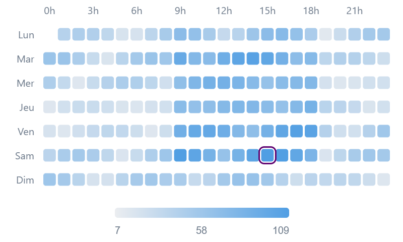

# Punchcard

A compact hour-of-day × day-of-week activity grid for Metabase. Each cell represents one (day, hour) pair, colored and/or sized by value intensity. Instantly reveals weekly activity patterns and peak hours.



## Requirements

- Metabase **≥ 1.62.0**

## Installation

1. Download `punchcard-X.Y.Z.tgz` from the [latest release](https://github.com/ouquoi/metaviz-punchcard/releases/latest)
2. In Metabase, go to **Admin → Visualizations**
3. Click **Add a visualization**
4. Upload the `.tgz` file

## Usage

### Query

Your question must return three numeric columns: a day-of-week (0–6), an hour-of-day (0–23), and a measure.

```sql
-- PostgreSQL: EXTRACT(DOW ...) returns 0=Sunday … 6=Saturday
SELECT
  EXTRACT(DOW FROM created_at)  AS day_of_week,
  EXTRACT(HOUR FROM created_at) AS hour_of_day,
  COUNT(*)                       AS validations
FROM events
GROUP BY 1, 2
ORDER BY 1, 2
```

### Select the visualization

In the question editor, open the visualization picker and select **Punchcard**.

### Configure settings

#### Data

| Setting | Description | Default |
|---------|-------------|---------|
| Day column (0–6) | Column containing the day of week (integer 0–6) | First column matching `day`/`jour`/`dow` |
| Hour column (0–23) | Column containing the hour of day (integer 0–23) | First column matching `hour`/`heure` |
| Value column | Column used for cell intensity / size | First remaining numeric column |

#### Appearance

| Setting | Description | Default |
|---------|-------------|---------|
| Cell shape | `Square` or `Circle` | `Square` |
| Week starts on | `Monday` or `Sunday` — sets the row label order | `Monday` |
| Visual encoding | `Color intensity` / `Cell size` / `Size + color` | `Color intensity` |
| Color — low values | Color for the lowest values | `#ebedf0` |
| Color — high values | Color for the highest values | `#509EE3` |

## Capabilities

| Feature | Details |
|---------|---------|
| Grid | 7 rows (days) × 24 columns (hours) |
| Peak highlight | The cell with the highest value is outlined automatically |
| Hover tooltip | Shows day, hour, and value on hover; dims other cells |
| Drill-through | Click a cell to filter by day of week |
| Animation | Cells fade in sequentially on load (SVG native, sandbox-safe, respects `prefers-reduced-motion`) |
| Dark mode | Full dark theme support |
| Responsive | Adapts to any card size |
| Missing cells | Pairs absent from the data are shown as empty (neutral) cells |

## Data requirements

| Column | Type | Notes |
|--------|------|-------|
| Day column | Integer | Values 0–6; out-of-range rows are ignored |
| Hour column | Integer | Values 0–23; out-of-range rows are ignored |
| Value column | Numeric | Negative and null values are treated as missing |

The visualization requires at least 3 numeric columns. If fewer are available, a clear error message is displayed.

### Day convention

The expected day-of-week convention depends on your database:

| Database | Function | 0 = | Set "Week starts on" |
|---|---|---|---|
| PostgreSQL | `EXTRACT(DOW FROM ...)` | Sunday | Sunday |
| MySQL | `DAYOFWEEK(...)` − 1 | Sunday | Sunday |
| Custom (Mon=0) | manual mapping | Monday | Monday |

## Development

```bash
cd punchcard
npm install
npm run dev          # watch mode — connect Metabase dev server to http://localhost:5174
npm run preview:viz  # standalone preview at http://localhost:5177
npm run build        # compile + generate .tgz
```

## License

MIT
